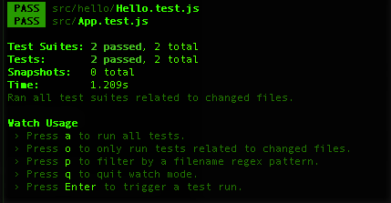
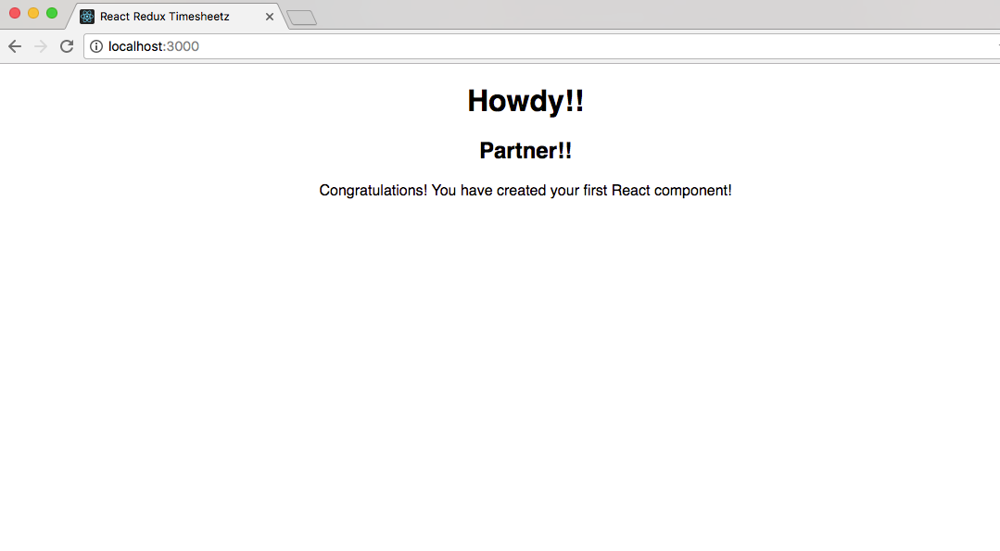
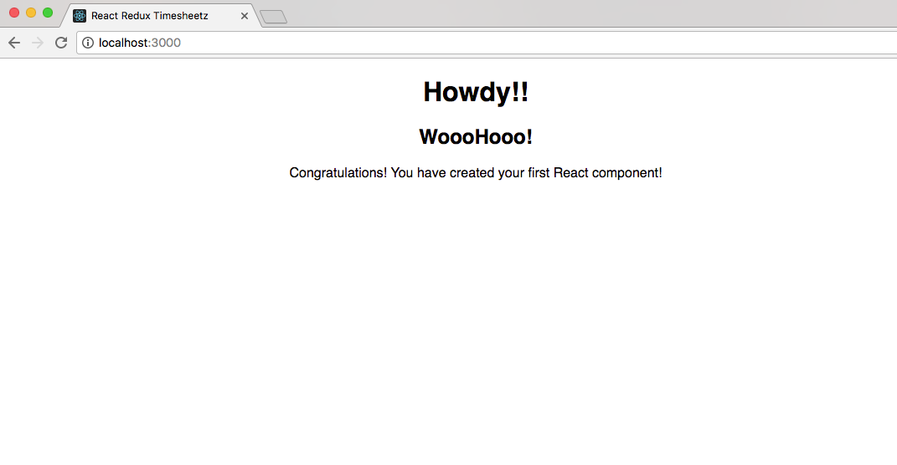

# Lab Two - Your First React Component

## Checkout the Lab Branch
- In a terminal:

```
git checkout lab-02-first-component-start
git pull
npm install
```

If not running, start the `npm start` task.  Otherwise, restart the running tasks to pick up any changes in the lab-02-first-component-start branch.

&nbsp;
## Create the Hello World component

- Open **/src/hello/Hello.js**
- This is going to be the component that we will render to the screen.

- The first thing we want to do is `import` **React** and the React **Component** into our module. At the top of the page add:

```javascript
import React, { Component } from 'react';
```

- Next let's create our empty **React** class and have the module `exports` the class:

```javascript
class Hello extends Component {

}

export default Hello;
```

- Now we have to tell **React** what we want the module to draw to the page.
- To do this we need to implement a `render()` method:

- Inside the `class`, add the below method:

```javascript
  render() {
    return (
      <div className="hello">
        <h1>{this.state.greeting}</h1>
        <h2>{this.props.friend}</h2>
        <p>Congratulations!  You have created your first React component!</p>
      </div>
    );
  }
```

- Let's look at what we just did:
  - We've supplied a `JSX` template that adds a couple of headers along with a paragraph.
  - The h1 header is going to display the `greeting` value on the component's state.
  - The h2 header is going to display the value of the `friend` "prop" or attribute passed in by the parent component rendering this component.


- We want to initialize our component with data, so let's give the component a default state.
  - To do this we need to implement `constructor` which will be called by React when initializing the component.
- Add the method below to your component:

```javascript
  constructor(props) {
    super(props);
    this.state = {
      greeting: 'Howdy!!'
    };
  }
```

- Now we need set the default value for the `friend` prop in case the caller doesn't include the attribute in the `JSX`.
  - To do that, we implement `defaultProps` after the class definition and before the export

```javascript
Hello.defaultProps = {
  friend: 'Partner!!'
};
```

- When complete, the entire module should look like:

```javascript
import React, { Component } from 'react';

class Hello extends Component {

  constructor(props) {
    super(props);
    this.state = {
      greeting: 'Howdy!!'
    };
  }

  render() {
    return (
      <div className="hello">
        <h1>{this.state.greeting}</h1>
        <h2>{this.props.friend}</h2>
        <p>Congratulations!  You have created your first React component!</p>
      </div>
    );
  }
}

Hello.defaultProps = {
  friend: 'Partner!!'
};

export default Hello;
```

&nbsp;
## Test the component

- Now that we've created our first component, let's test it to make sure that React can initialize and render it to the DOM.

- Open **/src/hello/Hello.test.js**
- First, let's import our libraries for `React` `Hello` and `react-test-renderer`
- Then, let's set up the Hello World test by adding a suite (describe block):


```javascript
import React from 'react';
import Hello from './Hello';
import renderer from 'react-test-renderer';


describe('Hello World:', function () {


});
```

- Now we need to set up our components that we'll be testing.

```javascript
    it('should render with default text', function () {

        const component = renderer.create(
                <Hello/>
        );

        let stringVal = JSON.stringify(component);
        expect(stringVal).toMatch(/Howdy/);
        expect(stringVal).toMatch(/Partner/);
   
    });

    it('should render with our props', function () {

        const component = renderer.create(
                <Hello friend="Fred"/>
        );

        let stringVal = JSON.stringify(component);
        expect(stringVal).toMatch(/Howdy/);
        expect(stringVal).toMatch(/Fred/);

    });


```
> What is happening here? We use React's [test renderer](https://github.com/facebook/react/tree/master/packages/react-test-renderer) to render the component into a sandboxed "document" so that we can perform inquiries. Notice that we are using `JSX` in the `renderer.create()` method.

- When finished, your suite should look similar to the one below:

```javascript
import React from 'react';
import Hello from './Hello';
import renderer from 'react-test-renderer';

describe('Hello World:', function () {


    it('should render with default text', function () {

        const component = renderer.create(
                <Hello/>
        );

        let stringVal = JSON.stringify(component);
        expect(stringVal).toMatch(/Howdy/);
        expect(stringVal).toMatch(/Partner/);
   
    });

    it('should render with our props', function () {

        const component = renderer.create(
                <Hello friend="Fred"/>
        );

        let stringVal = JSON.stringify(component);
        expect(stringVal).toMatch(/Howdy/);
        expect(stringVal).toMatch(/Fred/);

    });

});

```

- If it's not already running, open your terminal and run the test (`npm test`) command.



- Did your test pass?

- There are a couple of other tests we could perform:
  - Test that the initial state was rendered inside the element.
  - Test that the default prop was rendered inside the element.
  - We'll do more of this style testing in upcoming labs, but you can study ahead in the [React docs for TestUtils.](https://facebook.github.io/react/docs/test-utils.html)

&nbsp;
## Let's render Hello World to the Browser!!

- Open **src/App.js**, and tell **React** to render our component into our app.
  - We first need to import our **Hello** component.
  - We then use the `render()` method to place it on our page:

```javascript
import Hello from './hello/Hello';
```
```
  render() {
    return (
      <div className="App">

        <Hello />

      </div>
    );
  }
```

&nbsp;
## Run the application and see your work.

- In a terminal windows run: `npm start` to fire off the build.
- Navigate to [http://localhost:3000](http://localhost:3000) in your favorite browser.



- Since we didn't set the `friend` prop on our component, the default value is displayed.
- To override it, we just add the prop as an attribute to our JSX in the render method.

```javascript
<Hello friend="WoooHooo!" />
```

- Now refresh the page. The default prop should have been overridden.



&nbsp;

### Commit your changes to Git and get ready for the next lab.

```
git add .
git commit -m 'Lab 2 completed successfully'
```

## Extra Credit
If you're looking for an extra challenge, take a look at [Jest Snapshot testing](http://facebook.github.io/jest/blog/2016/07/27/jest-14.html). On first run, jest will generate a snapshot file that represents the rendered react component in a \_\_snapshots\_\_ folder. On subsequent runs it will compare the test result to the previous snapshot file. On a failure you will have to decide whether to fix the code, modify the test, or press 'u' to update the snapshot file with the new rendering.

Try creating a Snapshot test inside Hello.test.js, or:<details><summary>Click here for an example</summary><p>

```
    it('should render to match the snapshot', function () {

        const component = renderer.create(
            <Hello friend="Luke"/>
        );

        const json = component.toJSON();
        expect(json).toMatchSnapshot();
    });
```

</p></details>

Now take a look at the generated \_\_snapshots\_\_/Hello.test.js.snap file to see what the rendered Hello component looks like
- Modify the test to render `<Hello friend="Leia"/>`
- Now update the snapshot to match the updated test, re-run the tests, and see that they are all passing

Don't forget to `git add .` and `git commit -m "extra credit"` when you are done
